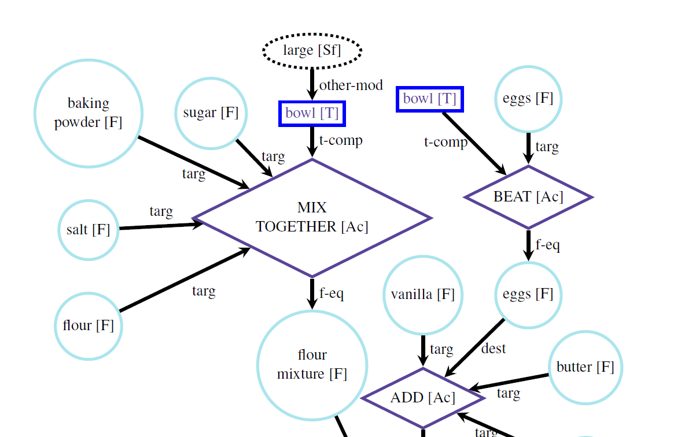

# ara_seminar_research

In this repo we will document the reproducibility issues of the paper [Aligning Actions Across Recipe Graphs](https://aclanthology.org/2021.emnlp-main.554/).

 

## Starting Point
To reproduce the paper's claimed results, please start with creating the exactly same environment the paper used:
```shell
conda create -n ada python==3.7
conda activate ada
pip install -r requirements.txt
``` 
For compability issues, please check the next section. 

## Issues Part

### Issues with Aligment_Model/requirements.txt 

### The problem:
They provide package versions that are not compatible with eachother. Pandas 1.2.3 is not compatible with Python 3.7  

### The fix: 
Just download Pandas 1.1

### Issues with CUDA compilation:
CUDA would complain since the original paper is using a super old version of `torch==1.7.1` and the new generation of GPUs can not be compiled with old version torch, this will cause `torch.device("cuda")` unusable. \
To solve this error, please run the following commands:   
```shell
pip uninstall torch
pip3 install torch==1.7.1  --force-reinstall  --extra-index-url https://download.pytorch.org/whl/cu110
```

## Data
To get started run the following commands to get the data: 
```shell
git clone https://github.com/MikeySaw/ara_seminar_research
git clone https://github.com/interactive-cookbook/alignment-models
mv alignment-models/data/ ara_seminar_research/
```

## Training
To train the model, run the following command from root directory:

`python train.py [model_name] --embedding_name [embedding_name] --fold [fold]`

where `[model_name]` could be one of the following:
- `Sequence` : Sequential Ordering of Alignments
- `Cosine_similarity` : Cosine model (Baseline)
- `Naive` :  Common Action Pair Heuristics mode (Naive Model)
- `Alignment-no-feature` : Base Alignment model (w/o parent+child nodes)
- `Alignment-with-feature` : Extended Alignment model (with parent+child nodes)

and `[embedding_name]` could be one of the following:
- `bert` : BERT embeddings (default)
- `elmo` : ELMO embeddings

additionally `[fold]` is a number between 1 and 10:
    Here you specify on which fold to run the validation on

Right now the `Naive` and `Cosine-similarity` models don't work.
    
## Testing
To test the model, choose the application from the following:

Run the following command from this directory:

`python test_best_alignment.py [model_name] --embedding_name [embedding_name]`

As output, a prediction file named after the test dish(es) will be created. Here the best alignment computed for each action of the test recipes is saved.

The testing script is __not__ working according to what is described in the paper and the original repo.

